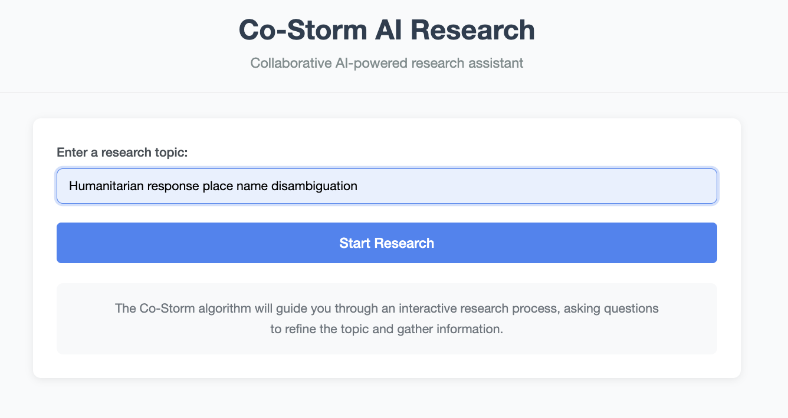
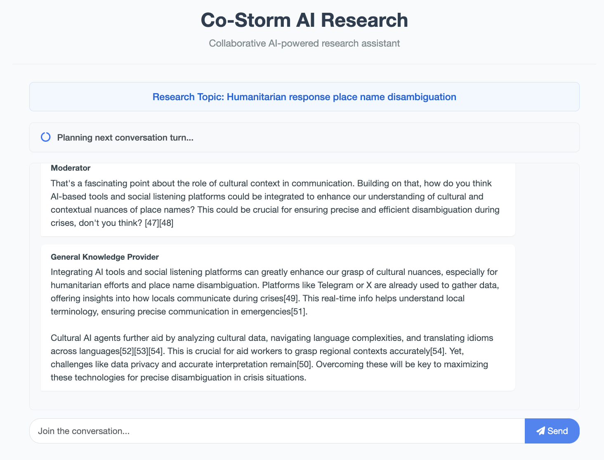
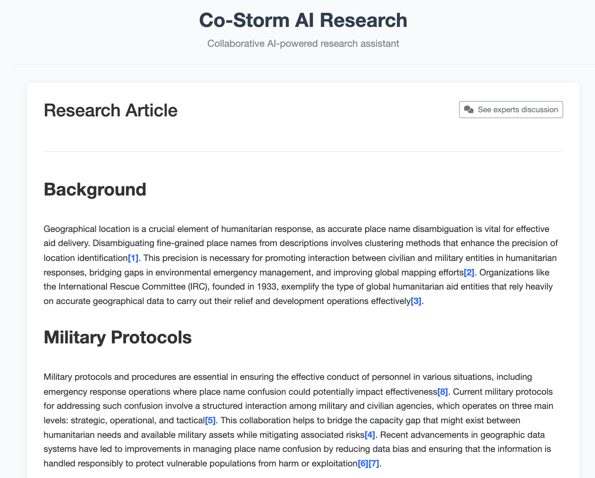

<div style="padding: 15px; border-radius: 5px; background: #d9edf7; color: #31708f; border-left: 5px solid #31708f;">
  <strong>ℹ️ Info:</strong> This application was created using mostly AI prompting in Cursor, as part of [this blogpost]()
</div>


# Co-STORM AI Research Web Interface

This web application provides an interface for the [Co-Storm AI research algorithm](https://storm.genie.stanford.edu/article/do-polls-predict-elections%3F-135449). It allows users to input a research topic and engage in an interactive conversation with the AI to refine the research and generate a comprehensive article with citations.





## Features

- Interactive chat interface for collaborative research
- AI-guided research process that asks questions to refine the topic
- Intelligent waiting for human input with typing detection
- Final output as a well-structured article with citations
- Ability to download the research article as a Markdown file
- Real-time updates during the research process
- Status bar with visual feedback during long-running operations

## Prerequisites

- [miniconda](https://www.anaconda.com/docs/getting-started/miniconda/install) 
- OpenAI API key
- A search engine API key (Serper, Bing, or Tavily)

## Installation

1. Clone this repository:
   ```
   git clone https://github.com/dividor/costorm-ui.git
   cd costorm-ui
   ```

2. Set up an environment ...

```
conda create -n storm python=3.11
conda activate storm
pip install -r requirements.txt
```

3. Install the required dependencies:
   ```
   pip install -r requirements.txt
   ```

4. Copy `.env.example` to `.env` and populate OPENAI_API_KEY and SERP_API_KEY. Note: You can use other LLMs and search engines, as well as your own function. See the [Storm Repo](https://github.com/stanford-oval/storm/tree/main) for more details.


## Usage

1. Start the web application:
   ```
   python app.py
   ```

2. Open your web browser and navigate to:
   ```
   http://localhost:5001
   ```

3. Enter a research topic in the input field and click "Start Research". An example research topic might be "humanitarian response place name disambiguation"

4. Engage with the AI in the chat interface to refine your research topic. You can enter your contribution any time. 

A followup to the example topic, when the AI asks about technologies, could be ...

"A blockchain (e.g., Ethereum or Hyperledger Fabric) can host an authoritative, consensus-based registry of geospatial identifiers, creating an immutable ledger of disambiguated place references. A decentralized ledger for geographic disambiguation, combined with off-chain spatial indexes."

5. Once the research is complete, the application will display the final article with citations

6. You can download the article as a Markdown file or start a new research session

## Environment Variables

The application uses environment variables for configuration. These can be set in a `.env` file in the root directory. A sample `.env.example` file is provided as a template.

Key environment variables include:

| Variable | Description | Default |
|----------|-------------|---------|
| `OPENAI_API_KEY` | Your OpenAI API key | None (Required) |
| `RETRIEVER_TYPE` | Search engine to use (serper, bing, tavily) | serper |
| `SERPER_API_KEY` | Serper API key (if using Serper) | None |
| `BING_SEARCH_API_KEY` | Bing Search API key (if using Bing) | None |
| `TAVILY_API_KEY` | Tavily API key (if using Tavily) | None |
| `NUM_TURNS` | Number of conversation turns | 10 |
| `HUMAN_WAIT_TIME` | Seconds to wait for human input | 10 |
| `RETRIEVE_TOP_K` | Number of top search results to retrieve | 10 |
| `MAX_SEARCH_QUERIES` | Maximum number of search queries | 2 |
| `MAX_SEARCH_THREAD` | Maximum number of search threads | 5 |
| `MAX_SEARCH_QUERIES_PER_TURN` | Maximum search queries per turn | 3 |
| `WARMSTART_MAX_NUM_EXPERTS` | Maximum number of experts for warm start | 3 |
| `WARMSTART_MAX_TURN_PER_EXPERTS` | Maximum turns per expert for warm start | 2 |
| `WARMSTART_MAX_THREAD` | Maximum threads for warm start | 3 |
| `MAX_THREAD_NUM` | Maximum number of threads | 10 |
| `MAX_NUM_ROUND_TABLE_EXPERTS` | Maximum number of round table experts | 2 |
| `MODERATOR_OVERRIDE_N_CONSECUTIVE_ANSWERING_TURN` | Consecutive expert turns before moderator override | 3 |
| `NODE_EXPANSION_TRIGGER_COUNT` | Trigger node expansion for nodes with more than N snippets | 10 |

## License

This project is licensed under the MIT License - see the LICENSE file for details.

## Running the Co-STORM sample script

If you are interested in running the sample Co-STORM script `run_costorm_gpt.py` used as the starting point for AI to generate this app (as found on in the Co-STORM repo examples, adjusted with a minor bug fix) ...

1. Create a `secrets.toml` file based on the provided example:
   ```
   cp secrets.toml.example secrets.toml
   ```

2. Edit the `secrets.toml` file to add your API keys:
   ```
   OPENAI_API_KEY = "your-openai-api-key"
   OPENAI_API_TYPE = "openai"
   SERPER_API_KEY = "your-serper-api-key"  # Or use BING_SEARCH_API_KEY or TAVILY_API_KEY
   ```

You can then run the script with `python run_costorm_gpt.py --output-dir ./results --enable_log_print --retriever serper`

## Security Considerations

This application implements several security measures to protect against common vulnerabilities:

### Environment Configuration

- **Secret Key Management**: The application uses environment variables for sensitive configuration like API keys and the Flask secret key.
- **CORS Configuration**: By default, CORS is restricted to specific origins in production mode.
- **Debug Mode**: Debug mode is disabled in production to prevent information leakage.
- **Server Binding**: In production, the server binds only to localhost by default, requiring a reverse proxy for public access.

### Input Validation and Rate Limiting

- **Input Validation**: All user inputs are validated for type, length, and content.
- **Rate Limiting**: API endpoints are protected by rate limiting to prevent abuse.
- **Session Management**: User sessions are properly managed and cleaned up after disconnection.

### File System Security

- **Path Sanitization**: File paths are sanitized to prevent directory traversal attacks.
- **Secure Permissions**: Output directories are created with restricted permissions.

### Deployment Recommendations

For production deployment, we recommend:

1. **Use a Reverse Proxy**: Deploy behind Nginx or Apache with proper TLS configuration.
2. **Set Environment Variables**: Configure all security-related environment variables.
3. **Regular Updates**: Keep all dependencies updated to patch security vulnerabilities.
4. **Monitoring**: Implement monitoring to detect and respond to unusual activity.

The following environment variables should be set for enhanced security:

| Variable | Description | Recommendation |
|----------|-------------|----------------|
| `SECRET_KEY` | Flask session encryption key | Use a strong random value |
| `CORS_ORIGINS` | Allowed origins for CORS | Comma-separated list of trusted domains |
| `FLASK_ENV` | Application environment | Set to 'production' |
| `HOST` | Host to bind the server to | Use '127.0.0.1' and proxy with Nginx/Apache |

